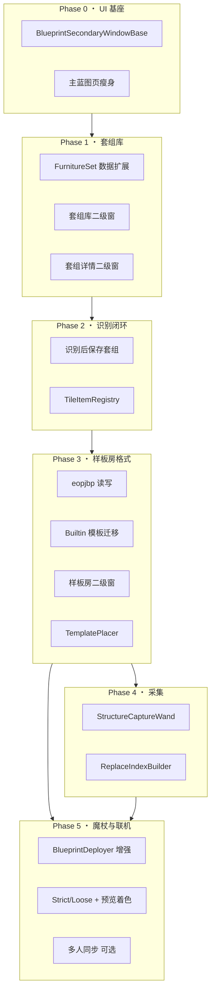
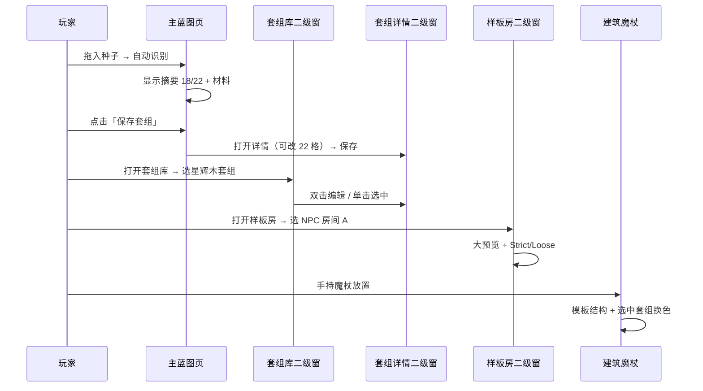
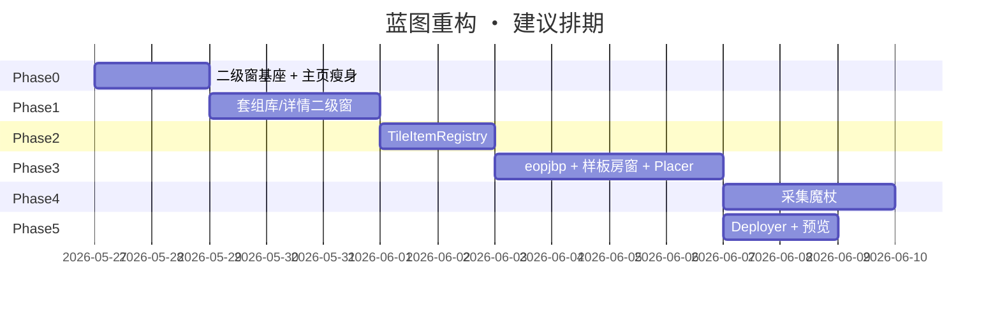

# 家具蓝图 ― 分步实现路线图

> **配套文档**：[`BLUEPRINT_REFERENCE.md`](BLUEPRINT_REFERENCE.md)（技术细节与参考链接）、[`FURNITURE_BLUEPRINT.md`](FURNITURE_BLUEPRINT.md)（22 格识别赋分）  
> **UI 原则**：主窗体页签保持**轻量入口**；复杂编辑/列表/大预览放在**独立二级窗体**（尺寸自定），视觉与主壳统一。  
> **用法**：你说「看看文档」→ 先看下方 **§A 当前进度**，再按 **§B 阶段清单** 里第一个未勾选项继续。

---

## A. 当前进度（会话续工入口）

| 字段 | 值 |
|------|-----|
| **当前阶段** | Phase 3 ? 代码完成（3.1�C3.8）→ **下一步 Phase 4**（结构采集魔杖）；§B.0.5 / §B.1.7 / §B.2.5 待游戏验收 |
| **最后更新** | 2026-05-27（v0.5.13） |
| **编译** | `dotnet build` 通过 |
| **游戏内待验** | §B.0.5 + §B.1.7 + §B.2.5 |

### A.1 主窗布局（v0.5.3 共识）

```
┌─ 种子槽 │ 材料槽 │ [折叠] [建筑方案] [保存套组] ─ 识别：星流椅 → 18/22 ─┐
│ （识别完成时）保存提示：点击「保存套组」以保留当前结果                      │
│ 【家具套组识别】22 格网格（只读，随识别刷新）                              │
│ 【已保存的套组】                                    [新建空套组]            │
│   [48px封面] 星辉木 (18/22)  [改名] [编辑] [删除]                         │
│   …                                                                       │
└───────────────────────────────────────────────────────────────────────────┘
```

- **主窗**：识别 22 格 + 已保存套组列表（撑满底部）；材料行右侧「建筑方案 / 保存套组」
- **二级窗**：样板房（640×560）、套组详情/编辑（560×480，含封面槽+删除）；套组库二级窗已废弃
- **本地化**：蓝图 UI 统一 `EOPJText.UIOr` + hjson；源码 fallback 用 ASCII 防乱码

### A.2 已完成（累计）

| 里程碑 | 文件/能力 |
|--------|-----------|
| v0.5.7 保存会话 | `_sessionOverwriteExisting`、Guid 新 id、`CreateEmptySchemeDraft`、另存为新套组 |
| v0.5.13 Phase 3.7�C3.8 | `LegacyDatamapImporter` + 模板资源三文件 + 加载验收 |
| v0.5.12 Phase 3.6 | `BlueprintTemplatePlacer` + `ResolveActiveTemplate` + Deployer 主路径 |
| v0.5.11 Phase 3.5 | `BlueprintPlacementMode` Strict/Loose + 样板房切换 + 放置器一致 |
| v0.5.10 Phase 3.4 | 样板房窗 38/62 分栏 + 模板卡片 + 统一 `ResolveActiveLayout` |
| v0.5.9 Phase 3.3 | 内置模板 → `Assets/Blueprint/Templates/`；优先 .eopjbp 加载 |
| v0.5.8 Phase 3.2 | `BlueprintTemplateIO`：`.eopjbp` 单文件 + 目录三文件 round-trip |
| v0.5.7 Phase 3.1 | `Templates/BlueprintTemplate` + `StructureCell` + `ReplaceRule`；`FromLegacyLayout` |
| v0.5.6 Phase 2 闭环 | 识别覆盖、`FurnitureSetMaterialValidator`、快照 `LastRecognitionSnapshot` |
| v0.5.5 Registry | `FurnitureTileItemRegistry` + `FurnitureSetMaterialCheckers`（与识别隔离） |
| v0.5.4 验收修复 | 汉化、保存覆盖、新建按钮布局 |
| v0.5.3 主窗布局 | 材料行按钮、列表撑满、`新建空套组`、`BlueprintUiFlatButton` 居中 |
| v0.5.3 二级窗 | 样板房重写；详情弹性网格 + 封面槽 + 删除 |
| v0.5.3 数据 | `CreateEmptySchemeDraft`（原 `CreateEmptyCustomScheme`）、`FurnitureSchemeNaming`、封面左→右首槽 |
| v0.5.3 提示 | `RecognitionAwaitingSave` + `StatusSavePrompt` |
| Phase 0 基座 | `BlueprintSecondaryWindowBase`、三二级窗、cascade 布局 |
| v0.5.2 主窗 | `FurnitureBlueprintPage` 识别网格 + 套组列表 |
| v0.5.2 套组行 | `FurnitureBlueprintSchemeRow`：选中高亮 + 改名/编辑/删除 |
| v0.5.2 数据 | `DeleteCustomScheme` / `RenameCustomScheme` |
| v0.5.2 改名 UI | `BlueprintSchemeRenameOverlay` |
| v0.5.2 文案 | `EOPJText.SlotLabel`、hjson 补键 |

### A.3 下一步（按顺序）

1. **Phase 4.1** `StructureCaptureWand` 两点选区采集
2. **§B.0.5 / §B.1.7 / §B.2.5** 游戏内验收（见 `BLUEPRINT_PHASE3_GUIDE.md`）

---

## B. 阶段清单（可勾选，逐项追踪）

### B.0 Phase 0 ― UI 基座 ?（代码完成）

**目标**：二级窗骨架可复用；**v0.5.2 已调整**：识别网格与套组列表回到主窗（见 §A.1）。

- [x] **0.1�C0.4** 基类、注册、cascade、布局常量
- [x] **0.3 修订** 主窗含识别 22 格 + 套组列表（非纯 Hub 四按钮）
- [ ] **0.5 游戏内验收**
  - [ ] 主窗：识别网格随种子/材料刷新
  - [ ] 主窗：套组列表左键选中金框，启用当前套组
  - [ ] 行按钮：改名弹窗 / 编辑开详情窗 / 删除生效
  - [ ] 文案无 `Mods.EvenMoreOverpoweredJourney` 泄露
  - [ ] 主窗：材料行右侧「建筑方案 / 保存套组」；已保存列表占满底部
  - [ ] 主窗：「新建空套组」+ 默认名递增
  - [ ] 识别完成后保存提示行可见
  - [ ] 样板房 / 详情二级窗文案无乱码
  - [ ] 详情窗 22 格随窗宽换行；封面槽可拖入

---

### B.1 Phase 1 ― 套组库与详情（进行中 ?）

- [x] **1.1** 数据模型 `IconItemType` + Tag 持久化 + 列表 32px 封面
- [x] **1.2** Player API：`DeleteCustomScheme` / `RenameCustomScheme`
- [x] **1.2b** 主窗列表：`FurnitureBlueprintSchemeRow` 左键选中 + 改名/编辑/删除
- [x] **1.2c** `BlueprintSchemeRenameOverlay` 重命名浮层
- [x] **1.2d** 主窗识别区：`RefreshRecognitionGrid` 22 格只读展示
- [x] **1.3** 列表行 48px 封面（`FurnitureBlueprintSchemeRow` 升级）
- [x] **1.4** 套组库二级窗 → 废弃，列表在主窗（`SetLibraryMovedHint`）
- [x] **1.5a** 详情窗 22 格可拖入编辑（`DisplayOnly = false`）
- [x] **1.5b** 详情窗封面槽 + 详情内删除按钮
- [x] **1.5c** 详情窗「另存为新套组」（编辑模式；`BtnSaveAsNewSet`）
- [x] **1.6** 识别完成 → 提示保存（`RecognitionAwaitingSave` + `StatusSavePrompt`）
- [x] **1.6b** 保存会话隔离（不误覆盖库内套组；见 v0.5.7 CHANGELOG）
- [ ] **1.7** 验收（识别→保存→改名→删→读档→另存为新）

---

### B.2 Phase 2 ― 识别闭环 + 反查表

- [x] **2.1** `Registry/FurnitureTileItemRegistry.cs`（PostSetupContent 建表）
- [x] **2.2** `Registry/FurnitureSetMaterialCheckers.cs`（22 槽 CheckersForItem，与识别管线隔离）
- [x] **2.3** 与 IG 24 槽 diff（`BLUEPRINT_REFERENCE.md` Checkers 索引表）
- [x] **2.4** 详情窗「从识别覆盖」按钮（`FurnitureRecognitionOverlay` + 快照）
- [ ] **2.5** 游戏内验收
  - [ ] 主窗识别完成后，打开详情窗手改若干槽
  - [ ] 点「从识别覆盖」→ 22 格恢复为识别结果（聊天栏提示成功）
  - [ ] 无种子/无材料时按钮提示正确，不崩溃
  - [ ] Registry：`FurnitureSetMaterialCheckers` / `Validator` 未被识别管线引用（架构隔离）

---

### B.3 Phase 3 ― 样板房数据与二级窗

- [x] **3.1** `Templates/BlueprintTemplate.cs` + `ReplaceRule` + `StructureCell` + `FromLegacyLayout`
- [x] **3.2** `Templates/BlueprintTemplateIO.cs`（`.eopjbp` + 目录三文件 round-trip）
- [x] **3.3** 内置模板迁移 → `Assets/Blueprint/Templates/`（5 套 + `TryLoadFromModAssets`）
- [x] **3.4** 样板房窗重写：左 38% 卡片 / 右 62% 预览 ≥280px
- [x] **3.5** Strict / Loose 切换 → Player 设置 + 放置器一致
- [x] **3.6** `Placement/BlueprintTemplatePlacer.cs` 替代主放置路径
- [x] **3.7** `Templates/LegacyDatamapImporter.cs`（PNG → Template）
- [x] **3.8** 验收：不依赖 RoomPreset PNG；放置顺序 墙→块→多格→单格

---

### B.4 Phase 4 ― 结构采集魔杖

- [ ] **4.1** `Capture/StructureCaptureWand.cs`（两点选区）
- [ ] **4.2** `Capture/WorldRegionScanner.cs`
- [ ] **4.3** `Templates/ReplaceIndexBuilder.cs`（22 槽 + Fixed）
- [ ] **4.4** 采集后「建议套组」→ 打开详情
- [ ] **4.5** 玩家模板目录 + 样板房「我的模板」Tab

---

### B.5 Phase 5 ― 建筑魔杖与预览

- [x] **5.1** `Items/BlueprintDeployer.cs` 接 TemplatePlacer + 当前套组
- [ ] **5.2** 世界幽灵预览红/绿/灰与二级窗一致
- [ ] **5.3** Strict 拒绝 + CombatText；Loose 跳过
- [ ] **5.4**（可选）联机 `NetMessage.SendTileSquare`

---

## C. 原路线图正文（架构图与参考）

## 0. UI 分层策略（开工前共识）

### 0.1 主窗体 vs 二级窗体

| 层级 | 职责 | 尺寸 | 参考 |
|------|------|------|------|
| **主窗 ・ 家具蓝图页** | 种子/材料、识别状态、快捷按钮、当前套组/模板摘要 | 沿用现有 Shell 宽度即可 | 瘦身后 ≤ 200px 有效内容高 |
| **二级窗 A ・ 套组库** | 已保存套组卡片、新建/删除/选中 | 建议 **480×520**（可调） | IG `StructureGUI` 列表 |
| **二级窗 B ・ 套组详情** | 22 格可编辑、重命名、封面、保存 | 建议 **560×480** | IG CreateWand 材质区 + 22 槽 |
| **二级窗 C ・ 样板房** | 模板卡片 + 大预览 + Strict/Loose | 建议 **640×560** | IG `StructurePreviewCard` + SH `ManualGeneratorMenu` |
| **二级窗 D ・ 材料候选** | 已有 `BlueprintMaterialSecondaryPanel`，微调样式即可 | 沿用 `FixedSecondaryWidth×Height` | 现有实现 |

二级窗体**不必**塞进主窗 content 区；挂到 `OPJourneyUI` 下与 `ItemHubSecondaryPanel` 同级，独立 `Left/Top/Width/Height`。

### 0.2 与主壳一致的设计元素（强制）

复用现有 Shell 组件与 token，**禁止**蓝图页再发明一套样式：

| 元素 | 使用 |
|------|------|
| 面板背景/边框 | `OPJourneyUiColors.PanelBackground` / `PanelBorder`（或 `DetailPanelBackground`） |
| 标题字号 | 与主窗标题一致：**0.82f**（见 `BlueprintTemplateSecondaryPanel` 标题） |
| 正文/说明 | **0.68f�C0.72f**，`Color.LightGray` / `DetailBodyText` |
| 关闭键 | `UICloseButton`（`Shell/UI/Components/UIBaseComponents.cs`） |
| 主操作按钮 | `BlueprintRoundedToolbarButton` 或 `UIFlatButton` |
| 滚动条 | `EojUIScrollbar` |
| Tab 选中态 | `OPJourneyUiColors.TabActiveBackground` + `AccentGoldOutline` |
| 间距网格 | **8px** 基准；面板内边距 **12px**（对齐 IG `SetPadding(12)`） |
| 可选拖拽 | `UIDraggablePanel` + 标题栏拖拽区（与主窗一致） |

---

## 1. 总流程图（阶段依赖）



---

## 2. 用户旅程（实现验收视角）



---

## 3. 分阶段任务清单

### Phase 0 ― UI 基座（1�C2 天）【? 代码完成，待游戏验收】

> 细项勾选见 **§B.0**。

**目标**：主窗不再堆功能；二级窗骨架可复用。

| # | 任务 | 产出文件 | 验收 |
|---|------|----------|------|
| 0.1 | 抽象 `BlueprintSecondaryWindowBase` | `BlueprintSecondaryWindowBase.cs` | ? |
| 0.2 | 注册三二级窗 + cascade 布局 | `OPJourneyUI.cs` | ? |
| 0.3 | 瘦身主蓝图页 | `FurnitureBlueprintPage.cs` | ? |
| 0.4 | 布局常量 | `FurnitureBlueprintPageLayout.cs` | ? |

**主蓝图页瘦身后布局：**

```
┌─ 种子槽 │ 材料槽 │ [材料…] ──────────── 识别：星流椅 → 18/22 ─┐
│ [打开套组库] [编辑当前套组] [样板房] [建造魔杖说明]              │
│ 当前套组：星辉木  │  当前模板：NPC 房间 A                        │
└────────────────────────────────────────────────────────────────┘
```

---

### Phase 1 ― 套组库与详情（2�C3 天）

**目标**：22 格识别结果可保存、可改名、可删、可改封面与单格物品。

| # | 任务 | 产出 | 验收 |
|---|------|------|------|
| 1.1 | `FurnitureScheme` 增加 `IconItemType`；持久化字段 | `FurnitureScheme.cs`、`FurnitureBlueprintPlayer.cs` | 读档保留 |
| 1.2 | `DeleteCustomScheme` / `RenameCustomScheme` | `FurnitureBlueprintPlayer.cs` | 库内删除后列表刷新 |
| 1.3 | **套组库二级窗**：卡片（48px 封面 + 名 + n/22 + 选中框） | `BlueprintSetLibraryPanel.cs`、`BlueprintSetCard.cs` | 单击选中、双击打开详情 |
| 1.4 | **套组详情二级窗**：8×3 可编辑槽 + 封面槽 + 名称输入 + 保存/删除 | `BlueprintSetDetailPanel.cs` | 拖入改格；封面默认材料块 |
| 1.5 | 识别完成 → 提示「保存为套组」或自动打开详情 | `FurnitureBlueprintPage` / Player | 一键入库 |

**仍保留**：`FurnitureSetRecognizer` 全线不变（见 FURNITURE_BLUEPRINT.md）。

---

### Phase 2 ― 识别闭环 + 反查表（1�C2 天）

| # | 任务 | 产出 | 验收 |
|---|------|------|------|
| 2.1 | `FurnitureTileItemRegistry`（PostSetupContent 线程建表） | 新文件 `FurnitureTileItemRegistry.cs` | tile/wall → item 可查 |
| 2.2 | `CheckersForItem` 22 槽（复用 `CreateWandHelper` 思路 + `FurnitureSlotClassifier` mod 兜底） | `FurnitureSetMaterialCheckers.cs` | 与 IG 24 槽 diff 文档化 |
| 2.3 | 套组详情「从识别覆盖」按钮 | `BlueprintSetDetailPanel` | 重新识别后写入当前编辑 |

---

### Phase 3 ― 样板房数据与二级窗（3�C4 天）

**目标**：摆脱 PNG datamap 作为主格式；放置走 structure + replace_index。

| # | 任务 | 产出 | 验收 |
|---|------|------|------|
| 3.1 | 定义 `BlueprintTemplate` / `ReplaceRule` / `StructureCell` | `FurnitureBlueprint/Templates/*` | 单元测试或控制台 dump |
| 3.2 | `.eopjbp` 读写（TagIO structure + binary replace） | `BlueprintTemplateIO.cs` |  round-trip 无损 |
| 3.3 | 内置 3 房间迁移（从 C# `BuildBorderRoom` 或手工采一次） | `Assets/Blueprint/Templates/` | 不再依赖 RoomPreset PNG |
| 3.4 | **样板房二级窗**重写：左 38% 卡片列表 / 右 62% 大预览（≥280px 高） | `BlueprintTemplatePanel.cs` | 缺件红/绿/灰着色 |
| 3.5 | Strict / Loose 切换 + 写入 Player 设置 | `FurnitureBlueprintPlayer` | 与放置器一致 |
| 3.6 | `BlueprintTemplatePlacer` 替代现有 `FurnitureBlueprintPlacer` 主路径 | `Placement/BlueprintTemplatePlacer.cs` | 墙→块→多格→单格顺序 |
| 3.7 | Legacy：`BlueprintDatamapLoader` → 导入为 Template | `LegacyDatamapImporter.cs` | IG 监狱 PNG 可导入 |

---

### Phase 4 ― 结构采集魔杖（2�C3 天）

| # | 任务 | 产出 | 验收 |
|---|------|------|------|
| 4.1 | `BlueprintRegionSelector`（参考 IG `SelectorItem` + SH 两点选区） | `StructureCaptureWand.cs` | 选区保存为 template |
| 4.2 | `WorldRegionScanner` → structure | 扫描器 | 含 mod 墙/块 |
| 4.3 | `ReplaceIndexBuilder` 自动 22 槽标注 + Fixed | 索引构建 | 火把等 → Fixed |
| 4.4 | 采集后可选「建议套组」→ 打开套组详情 | UI 流程 | 缺槽提示 |
| 4.5 | 玩家模板目录 + 样板房二级窗「我的模板」Tab | 文件系统 | 与内置模板并列 |

---

### Phase 5 ― 建筑魔杖与预览（2 天）

| # | 任务 | 产出 | 验收 |
|---|------|------|------|
| 5.1 | `BlueprintDeployer` 接 `BlueprintTemplatePlacer` + 当前套组 | `BlueprintDeployer.cs` | 游戏内一键放置 |
| 5.2 | 世界幽灵预览：缺件着色与二级窗一致 | `FurnitureBlueprintPreviewSystem` | 红/绿/灰 |
| 5.3 | Strict：缺件拒绝 + CombatText；Loose：跳过并日志 | Placer | 对齐 IG 双魔杖策略 |
| 5.4 | （可选）Server `NetMessage.SendTileSquare` 联机 | Placer | 多人可见 |

---

## 4. 二级窗体结构（实现模板）

所有蓝图二级窗继承 `BlueprintSecondaryWindowBase`，结构统一：

```
BlueprintSecondaryWindowBase
├── UIPanel _chrome          // OPJourneyUiColors.Panel*
├── UIDragHandle _titleDrag  // 可选
├── UIText _title            // 0.82f
├── UICloseButton            // 右上
├── UIElement _content       // 各子类填充
└── SetOpen(bool) / RecalcLayout()
```

**样板房二级窗 `_content` 内布局：**

```
┌─ 标题：样板房 ─────────────────────────────── [×] ─┐
├─ [Strict ?] [Loose ○] ─────────────────────────────┤
├──────────────┬───────────────────────────────────┤
│ 模板卡片列表  │  BlueprintPreviewFrame            │
│  (scroll)    │  (min 280px, tile 绘制)            │
│  38%         │  62%                               │
├──────────────┴───────────────────────────────────┤
│ 图例：绿=可放置 红=缺件 灰=固定装饰                 │
└────────────────────────────────────────────────────┘
```

---

## 5. 文件树（目标态）

```
FurnitureBlueprint/
  UI/
    BlueprintSecondaryWindowBase.cs      ← Phase 0
    FurnitureBlueprintPage.cs            ← Phase 0 瘦身
    BlueprintSetLibraryPanel.cs          ← Phase 1
    BlueprintSetDetailPanel.cs           ← Phase 1
    BlueprintSetCard.cs
    BlueprintTemplatePanel.cs            ← Phase 3 重写
    BlueprintMaterialSecondaryPanel.cs   ← Phase 0 样式对齐
  Templates/
    BlueprintTemplate.cs
    BlueprintTemplateIO.cs
    ReplaceIndexBuilder.cs
    LegacyDatamapImporter.cs
  Placement/
    BlueprintTemplatePlacer.cs
    PlacementMode.cs
  Registry/
    FurnitureTileItemRegistry.cs
    FurnitureSetMaterialCheckers.cs
  Capture/
    StructureCaptureWand.cs
    WorldRegionScanner.cs
  Items/
    BlueprintDeployer.cs
  (现有识别管线保持不动)
```

---

## 6. 建议开工顺序（本周）



**Day 1 具体动作（Phase 0.1�C0.3）：**

1. 新建 `BlueprintSecondaryWindowBase`（抄 `ItemHubSecondaryPanel` 的 `_body` + 关钮模式，尺寸用常量而非 `FixedSecondary` 限制死）
2. `OPJourneyUI` 挂载空壳 `BlueprintSetLibraryPanel` / `BlueprintSetDetailPanel`，重写 `BlueprintTemplatePanel` 继承基类
3. 删/移 `FurnitureBlueprintPage` 内 22 格大网格与底部 saved list → 改为按钮打开二级窗
4. 跑游戏：主 Tab 能开闭三个二级窗，样式与图鉴/物品 Hub 二级窗一致

---

## 7. 文档同步

| 阶段完成 | 更新 |
|----------|------|
| Phase 0�C1 | 本文勾选 + `CHANGELOG.md` |
| Phase 3 | `BLUEPRINT_REFERENCE.md` §4 格式定稿 |
| 识别赋分无变 | 无需改 `FURNITURE_BLUEPRINT.md` |

---

*路线图版本：2026-05-26 ・ 二级窗体策略已与用户确认*
