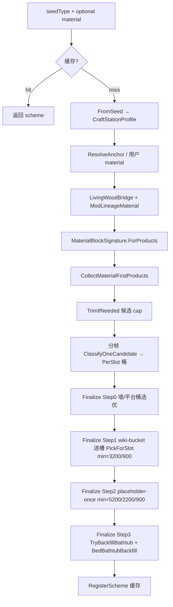

# 家具蓝图 — 全量判定逻辑导出（供外部 AI 诊断）

> **用途**：将 EMOJ 家具蓝图「从种子到 22 槽填完」的**全部判定分支、常量、门槛、文件映射**一次性导出，便于其他模型做回归诊断或提出补丁。  
> **代码根目录**：`FurnitureBlueprint/`  
> **对应实现版本**：mod ~0.5.6（2026-05）  
> **维基对照**：22 槽 = 20 家具 + Block + Wall（Platform 在识别顺序中单独处理）

---

## 0. 诊断时请先读

### 0.1 输入 / 输出

| 项 | 说明 |
|----|------|
| **输入** | `seedType`（种子物品 id）、可选 `anchorBlockOverride`（用户确认的材料块）、`forceRefresh` |
| **输出** | `FurnitureScheme`：22 个 `FurnitureSlotKind` → item type id（0 表示空） |
| **质量指标** | `CountWikiFilled(scheme)` = RecognitionOrder 中非空槽数量（0–22） |
| **完成条件** | 无硬性要求满 22；`wiki < 22` 记 `recognize incomplete` WARN |

### 0.2 主入口（调用链）

```
UI / TEST_BLUEPRINT
  → FurnitureSetRecognizer.BeginRecognition(seed, material, forceRefresh)
  → PrepareRecognitionJob
  → [分帧] FurnitureRecognitionRunner.Tick → ClassifyOneCandidate
  → [分帧] TickFinalizeScheme
       Step0 BeginFinalizeScheme (墙/平台桶)
       Step1 TickFinalizeWikiBucket (其余 wiki 桶，每帧 1 槽)
       Step2 TickFinalizePlaceholderSlot (空槽占位，每帧 1 槽)
       Step3 CompleteFinalizeScheme (浴缸回填 + 床浴 backfill)
  → job.Scheme
```

同步路径：`Recognize()` / 批量测试内 `while (!job.IsComplete)` 一次性跑完。

### 0.3 关键源文件索引

| 职责 | 文件 |
|------|------|
| 编排 / Finalize | `FurnitureSetRecognizer.cs` |
| 赋分 / 门槛 | `FurnitureSlotScoring.cs` |
| 选优 | `FurnitureSlotPicker.cs` |
| 分类 | `FurnitureSlotClassifier.cs` |
| 产物收集 | `FurnitureProductPipeline.cs`, `FurnitureMaterialProductCollector.cs` |
| 材料 StyleKey | `FurnitureMaterialBlockSignature.cs` |
| 死/无血统材料 | `FurnitureSetMaterialRules.cs` |
| 制作台 profile | `FurnitureCraftStationProfile.cs`, `FurnitureCraftStationRules.cs` |
| 反推材料 | `FurnitureReverseAnchorResolver.cs`, `FurnitureMaterialBlockResolver.cs` |
| 床浴回填 | `FurnitureBedBathtubBackfill.cs` |
| 候选上限 | `FurnitureRecognizeCandidateCap.cs` |
| 血统分 | `FurnitureSetLineageScoring.cs` |
| 批量测试 | `FurnitureBlueprintBatchTest.cs` |
| 22 槽顺序 | `FurnitureWikiSlots.cs` |

---

## 1. 端到端判定流水线



---

## 2. 材料块判定（反推 → 修正 → 正推 StyleKey）

### 2.1 自动材料（UI / `TEST_BLUEPRINT` 共用）

`FurnitureBlueprintBatchTest.ResolveAutoMaterialBlock(seed)` ≡ UI `ProposeMaterialBlockFromSeed`：

1. 若 `FurnitureMaterialBlockResolver.SeedIsMaterialBlock(seed)` → 种子即材料  
2. `FurnitureReverseSeedProbeCache.Ensure(seed)` 反推配方原料  
3. `FurnitureReverseRecipeIngredients.PickDefaultPlaceableBlock`  
4. 失败则 `FurnitureMaterialBlockResolver.ResolvePlaceableBlockFromProbe`  
5. **批量测试额外**（与 UI 识别前一致）：  
   - `FurnitureVanillaLivingWoodBridge.RedirectReverseAnchor`  
   - `FurnitureSetMaterialRules.ResolveModLineageMaterialBlock`  
   - `TryGetRecipeWoodMaterial` 覆盖为配方木  

**skip 条件**（批量）：`ResolveAutoMaterialBlock ≤ 0` → `batch-test skip … reason=no-material`（不计 wiki 分，但仍占 FULL 分母）。

### 2.2 识别 Job 内材料链

`PrepareRecognitionJob` 顺序：

```
anchor = anchorBlockOverride ?? ResolveAnchorMaterial(seed, signature)
anchor = LivingWoodBridge.RedirectReverseAnchor(seed, anchor)
anchor = SetMaterialRules.ResolveModLineageMaterialBlock(seed, anchor)
materialBlock = ResolveMaterialBlock(seed, anchor, seedItem, blockSig)
materialBlock = SetMaterialRules.ResolveModLineageMaterialBlock(seed, materialBlock)
if TryGetRecipeWoodMaterial → materialBlock = recipeWood
else if anchorBlockOverride → materialBlock = anchor
blockSig = MaterialBlockSignature.ForProducts(materialBlock, signature, seedType)
```

### 2.3 模组血统锚点 `UsesModLineageAnchor(seed)`

**真** 当：非 Terraria 物品，且 display/style 含任一：

- 中文：`无`、`死`、`虚无`、`古代`、`远古`  
- 英文 style：`nothing`、`dead`、`ancient`  

**`ResolveModLineageMaterialBlock`**：

- 若当前材料 **非** `IsForbiddenGenericMaterial` → 保留  
- 否则若允许 → 强制 `ItemID.Wood`  
- 否则 `TryResolveBlockFromFurnitureSeed`  
- 否则保留原值  

**`IsForbiddenGenericMaterial`**（血统种子）：除 `Wood/RichMahogany` 外，禁止高扇出 vanilla 块、所有 vanilla 木变种（Boreal/Palm/Ebon/…）。

**`ForProducts` StyleKey**（正推产物过滤）：

1. LivingWood set signature  
2. **`TryGetModLineageSetSignature`** → StyleKey = 种子血统名（如 Dead / Nothingness），**不是** “Wood”  
3. 否则材料块 `FromItemTypeForRecipes` 的 StyleKey  

> **已知诊断点**：死木 seed 若 `CraftStationProfile` 判为 `sawmill=True, enhancedWorkbench=False`，则 `material_style=Wood`，产物池为泛用木 125 件 → 床浴等选成原版 224/2126（分数仍可能 21/22）。

---

## 3. 制作台 Profile 判定

### 3.1 构建 `FurnitureCraftStationProfile.FromSeed(seed)`

1. 遍历 `GetRecipesForItem(seed)` 的 `requiredTile`  
2. **血统种子** `UsesModLineageAnchor` → 仅 `AddRecipeStationsDirectOnly`（不扩散 AdjTiles）  
3. 若无约束 → 再扫 `GetRecipesConsumingMaterial(seed)`  
4. 血统 → `StripIncidentalVanillaSpecialStations`  
5. 若 `UsesEnhancedWorkbenchSubstitution` → `ExpandEnhancedWorkbenchSubstitution`（并入 WorkBenches + 可选 AdjTiles）  
6. 再次 Strip  

### 3.2 `UsesEnhancedWorkbenchSubstitution(seed, profile)`

```
profile.IsConstrained
AND (
  UsesModLineageAnchor(seed)   ← 死/无等：恒 true（若 profile 有约束）
  OR (非 living 且 非 sawmill 且 HasModWorkbenchStation 且 无 vanilla 特殊台)
)
```

**效果**：

- **真**：收集产物时 **不** `ShouldExcludeFromProductCollect` 上位台专属家具；profile 含普通工作台  
- **假** + sawmill/living：排除「只能在上位/专属台」制造的 mod 家具  

日志字段：`craft stations seed=… living=… sawmill=… enhancedWorkbench=…`

---

## 4. 候选集判定

### 4.1 收集 `CollectMaterialFirstProducts`

1. `MaterialProductCollector.CollectFromMaterialBlock(material, productSig, stationProfile, seedType)`  
   - 内部按 `RecipeCompatible(stationProfile)` 过滤  
   - `ShouldExcludeFromProductCollect` 剔除对立制作台产物  
2. 若材料块可放置且非高扇出 → `AddPlacementLineSiblings`（同 tile+style，最多 64）  
3. **血统种子** → 再按 **种子** placement line 加兄弟（最多 64）  
4. 加入 seed 自身  

日志：`products strict seed=… block=… material_style=… count=… recipe_only=…`

### 4.2 修剪 `TrimIfNeeded`

| 条件 | 上限 |
|------|------|
| 默认 vanilla 材料 | 80 |
| mod 材料 | 52 |
| 种子/材料名含盐/血肉 | 36 |

保留优先级：seed +4000，material +3500，风格匹配 +2000，血统 +1500。  
**always** 保留 seed 与 material 类型。

### 4.3 分类入桶 `ClassifyOneCandidate`

- `FurnitureSlotClassifier.TryGetSlot` → `job.PerSlot[kind].Add(type)`  
- 实心材料砖不得占 wiki 家具槽（`BuildingBlockRules`）  
- 失败计入 `RejectedClassify`  

---

## 5. 分类判定（物品 → 槽位）

`FurnitureSlotClassifier.TryGetSlotCore` 优先级（高→低）：

1. 装饰排除（画/旗/奖杯…）  
2. 会话缓存  
3. 墙 / 平台图格  
4. 名称关键词（中英槽位词）  
5. 配方弱信号 `TryInferSlotFromRecipe`（≥2200 且领先 ≥600）  
6. Mod 图格分类  
7. RoomNeeds  
8. 几何 footprint + 图格 hint  
9. 注册表 `(tile,style)→slot`  
10. 实心砖 → Block  

**验收** `AcceptClassifiedKind`：床/箱/烛等需额外名称证据；纯材料砖不可进椅/床/蜡烛槽。

---

## 6. 赋分判定（`ComputeCandidateScore`）

### 6.1 硬门槛（任一失败 → score=0）

| 检查 | 条件 |
|------|------|
| 可评分 | `IsScorableForSlot`：可放置家具；非纯材料砖（Block/Wall/Platform 除外） |
| 装饰 | `IsDecorativeMark` |
| 椅 | `MeetsChairPickEvidence` |
| 床 | `MeetsBedPickEvidence` |
| 浴缸 | `MeetsBathtubPickEvidence` |
| 大烛台 | `PreferLampOverCandelabra` → 0 |
| 材料砖占 wiki 槽 | `MustNotOccupyWikiFurnitureSlot` |
| 种子自身 | **直接 25000**，短路 |
| 材料关联 | `IsMaterialLinked` 必须为 true |
| 血统重罚 | `ScoreSeedLineage ≤ -1400` 归零（**浴缸槽豁免**） |

### 6.2 `IsMaterialLinked` 为 true（任一）

- type == seedType  
- StyleKey 精确 / 模糊 / SameMaterialFamily  
- 配方精确消耗 materialBlock  
- 非高扇出且配方含 material  
- 与 blockSig 同 PlacementTile  
- 浴缸：`BathtubRules.SharesSetWithMaterial`  
- 床：高扇出材料需 lineage≥2100 或床图格/配方分≥600；否则 fuzzy style  
- 箱：style fuzzy match  

### 6.3 累加分项（节选常量）

| 项 | 值 |
|----|-----|
| MaterialLinkBase | 280 |
| StyleExact / Fuzzy / Family | 1800 / 720 / 260 |
| MaterialRecipeBonus | 680 |
| FootprintPerfect / Close | 5500 / 1300 |
| RoomNeedsAlign | 850 |
| NameStrong / Medium / Weak | 2800 / 1600 / 750 |
| MaterialPartNameStrong | 3400 |
| LineageStrong | **+4200** |
| MaterialOnlyPartial | **-2800** |
| CommonWordStrong | +2800 |
| ClassifyAlignBonus | +480 |
| SameModBonus | +50 |
| StationMatchCap | 200 |
| SeedExactBonus | 25000 |

**几何降级**：床/浴/沙发/梳妆台在无名称证据时，FootprintPerfect 按 Close(1300) 计。

### 6.4 选优门槛

| 场景 | 常量 | 值 |
|------|------|-----|
| 默认桶 / score-pool | MinBucketPickScore | **3200** |
| 床/浴（relaxed） | MinBed/BathtubPickScoreRelaxed | **900** |
| 占位（默认） | MinPlaceholderScore | **5200** |
| 床/浴占位（relaxed） | MinBedBathPlaceholderScoreRelaxed | **2200** |
| 占位池上限 | MaxPlaceholderCandidates | 48（扩展最多 ~192） |

**Relaxed 床/浴门槛** 当 `CanUseRelaxedPickThreshold`：

```csharp
GenericWoodLineageRules.IsMaterialAlignedWithSeedLineage(seed, material)
```

**Relaxed 床/浴占位** 额外：`CanUseRelaxedBedBathPlaceholder`（weak lineage seed / 同 mod 材料等）。

**平局**：lineage + name bonus 高者优先；仍平则 type id 小者优先。

**低于门槛**：`slot pick below threshold {bucket|score-pool|placeholder-once} … best=… score=… min=…` → pick=0。

---

## 7. Finalize 四阶段判定

### 7.1 Step 0 — `BeginFinalizeScheme`

- `BuildCommonWords` → ctx  
- **墙**：桶选优 → 失败 `WallResolver.TryResolveWallFromBlock`  
- **平台**：桶选优  

### 7.2 Step 1 — `TickFinalizeWikiBucket`

按 `FurnitureWikiSlots.RecognitionOrder` 跳过 Block/Wall/Platform，**每 tick 一个槽**：

```
ResolveSlotFromBucket → PickForSlot(min=GetMinPickScore)
```

日志：`slot-resolve seed=… slot=… pick=… pool=… source=wiki-bucket`

### 7.3 Step 2 — `TickFinalizePlaceholderSlot`

对 **仍为空** 的 wiki 槽（每 tick 一槽，每槽仅一次 `TryBeginPlaceholderAttempt`）：

1. `BuildFinalizeExpandedCandidates`（relaxed expand + 材料产物，cap≈96）  
2. `PlaceholderPool.Build(perSlot, expanded, occupied)`  
3. `PickForSlot(min=GetMinPlaceholderScore)`  

日志：`source=placeholder-once`

### 7.4 Step 3 — `CompleteFinalizeScheme`

顺序：

1. `LogEmptyWikiSlots` → `wiki empty seed=… Slot(pool=n),…`  
2. WARN 若 `finalWiki < 22`  
3. `TryBackfillBathtubFromCandidates`（仅浴缸；用 CandidateList + GetMinPickScore）  
4. `FurnitureBedBathtubBackfill.TryFillEmptySlots`（床+浴）  

#### 床浴 Backfill 判定

对每个空槽（Bathtub / Bed）：

1. **PickFromLineagePool**：CandidateList ∪ FinalizeCandidates → `PickByScoreFromProducts(min=GetMinPickScore)`  
2. 失败 → relaxed：`TryPickBathtubRelaxed` / `TryPickBedRelaxed`  
3. 仍失败 → **PickFromPlacementLine**：同 seed placement tile 兄弟，`requireStyleMatch=true`，rank = lineage + name，需 `rank ≥ LineageStrong/4 (1050)`  
4. 成功日志：`bed-bath backfill seed=… slot=… pick=…`  

---

## 8. 批量测试 `TEST_BLUEPRINT` 判定

### 8.1 模式

| 指令 | RunMode | 队列 |
|------|---------|------|
| `TEST_BLUEPRINT` | Sets | 每 Mod+StyleKey 一个代表 seed（优先桌/工作台） |
| `TEST_BLUEPRINT QUICK` | Quick | ~50 固定回归 id |
| `TEST_BLUEPRINT FULL` | Full | 全 `ItemLoader.ItemCount` 可识别种子 |

### 8.2 FULL 种子过滤 `IsRecognizableSeed`

- `IsPlaceableFurniture`  
- `SlotClassifier` 能分类  
- 归一化后非 None/Block/Wall/Platform  
- 非 `IsDecorativeMark`  

**未排除**：锭、雕像、装饰盆、单件祭坛 → FULL 会测到并拉低 **表面均分**。

### 8.3 统计公式（诊断用）

```csharp
// 当前实现
avg = wikiSum / _index;   // _index 含 skip（skip 贡献 0 分）

// 建议外部诊断时使用
effectiveAvg = wikiSum / recognizedCount;  // 仅 batch-test seed= 行
```

完成行字段：`full22`, `ge20`, `lt12`, `bed+bath-empty`, `skip_no_mat`, `fail`, `ms`

### 8.4 日志分流

| 级别 | 写入 |
|------|------|
| `FurnitureBlueprintLog.Info` | **simple.log**（Full 模式不写 10_blueprint） |
| `FurnitureBlueprintLog.InfoFull` | **10_blueprint.log**（skip、pick-scores、products strict…） |

---

## 9. 缓存判定

- Key：`(primarySeed, materialBlock)`  
- 注册条件：`GenericWoodLineageRules.IsSchemeCacheable`  
- Redirect：同套组其它 seed 可命中（材料一致）  
- `forceRefresh=true`（批量测试）跳过缓存  

---

## 10. 2026-05-27 FULL 批量日志 — 已验证失败模式（供对照）

会话：`Logs/EMOJ/2026-05-27_00-15-52`  
有效识别 2528，skip 2483，**真实均分 17.81**（非显示 8.99）。

### 10.1 `wiki empty` 槽位频率（1967 次）

Bathtub 1849 > Bed 1815 > Dresser 666 > Sofa 564 > Platform 531 > …

### 10.2 按根因分类

| 类型 | 特征日志 | 例子 |
|------|----------|------|
| **误种子** | material=3/11/13, wiki=2, cand≤80 | 锭、雕像 270+ 条 |
| **装饰盆** | material=133, material_style=Clay, wiki=14 | 15331 等 ~100 条 |
| **死木错血统** | enhancedWorkbench=False, material_style=Wood, pick=224/2126/34 | 13834–13850 |
| **无系列缺床浴** | enhancedWorkbench=True, ItemNothingness, wiki empty Bed/Bath | 13904 → 20/22 |
| **小套组** | count=2~7, wiki=18~19 | 生机/时光/暗影/深渊 |
| **实验室** | RustedPlating count=7, wiki=12~13 | 6502–6511 |
| **泛用木大池** | mat=9, cand=74+, wiki=18~21 | 木门25, 木桌32 |
| **材料错绑** | material=170 玻璃 | 死钟13841 wiki=6 |

### 10.3 分数分布（2528 有效）

| wiki | 数量 |
|------|------|
| 22 | 617 |
| 20–21 | 1149 |
| 18–19 | 301 |
| 12–17 | 96 |
| ≤11 | 365 |

---

## 11. 外部 AI 诊断检查清单

按优先级逐项核对日志：

1. **材料**：`material=…` / `material_style=…` / `reverse anchor` 是否合理？  
2. **制作台**：`enhancedWorkbench` 与种子血统是否一致？  
3. **候选**：`products strict … count=` 是否过小（<10）？  
4. **分类**：`classify_miss` 是否偏高？  
5. **选优**：`slot pick below threshold` 的 `best` vs `min` — 差多少？  
6. **占位**：是否走过 `placeholder-once`？  
7. **回填**：是否有 `bed-bath backfill`？  
8. **错读**：`recognize slots detail` 中是否出现跨 mod/跨血统 id（如死木槽位 224/2126）？  
9. **指标**：是否用 effectiveAvg 而非含 skip 的 avg？  

---

## 12. 建议诊断实验

```text
TEST_BLUEPRINT QUICK          # 回归种子，~50 项
TEST_BLUEPRINT                # 套组代表，去重
TEST_BLUEPRINT FULL           # 全量（注意 skip 污染 avg）

# 手动 UI 对照（simple.log 00:25+ 有 UI recognize 记录）
种子 13834 / 13904 / 13841 / 6502 / 15331 各跑一次 forceRefresh
```

---

## 13. 与现有文档关系

| 文件 | 内容 |
|------|------|
| `FURNITURE_BLUEPRINT.md` | 功能说明 + 赋分表（用户向） |
| `BLUEPRINT_IMPLEMENTATION.md` | 实现笔记 |
| **本文** | **全量判定逻辑 + 诊断清单（AI 向）** |

---

*导出时间：2026-05-27。若修改 `FurnitureSlotScoring` / `SetMaterialRules` / `Finalize` 流程，请同步更新 §6–§8。*
