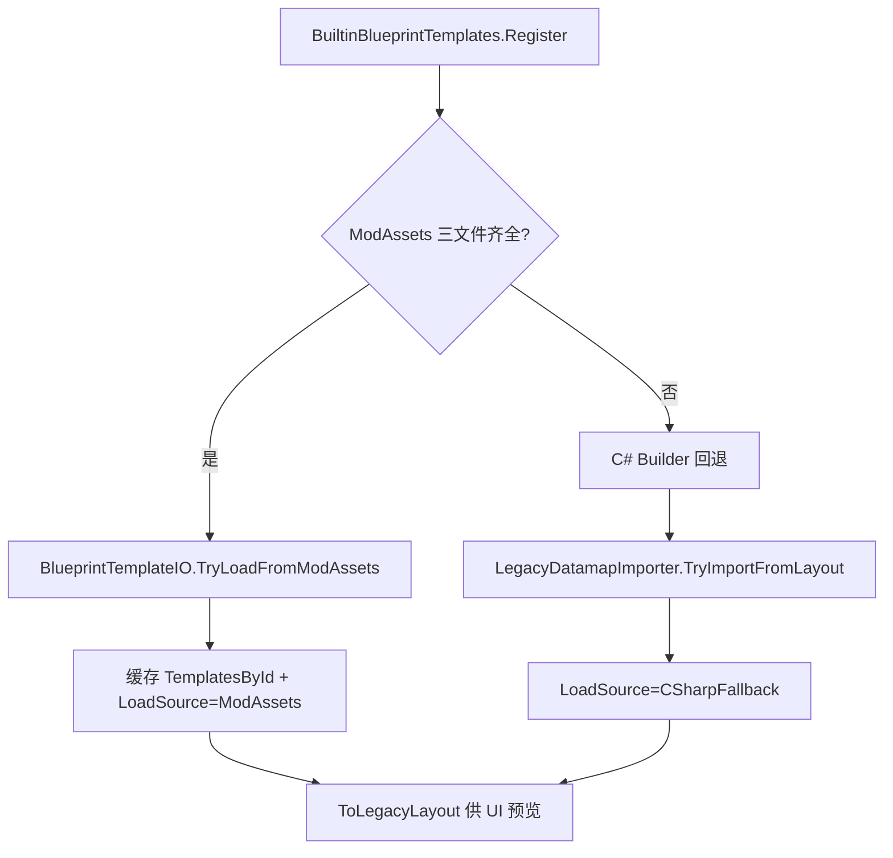
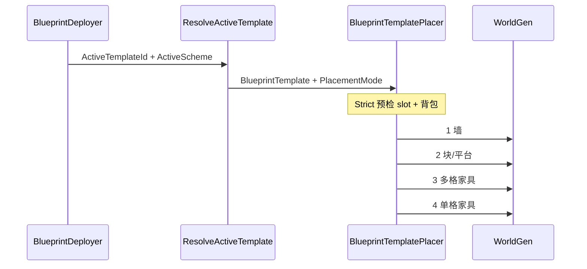

# 家具蓝图 Phase 3 ― 系统逻辑、功能说明与验收指南

> 版本：**v0.5.13**（Phase 3.1�C3.8 代码完成）  
> 关联：[`BLUEPRINT_IMPLEMENTATION.md`](BLUEPRINT_IMPLEMENTATION.md)、[`BLUEPRINT_REFERENCE.md`](BLUEPRINT_REFERENCE.md)

---

## 1. 系统逻辑（架构）

### 1.1 数据双层模型

样板房不再只靠 legacy `BlueprintLayout`（单格 `BlueprintCell`），而是 **structure + replace** 双数组：

| 层 | 类型 | 含义 |
|----|------|------|
| **structure** | `StructureCell[]` | 物理结构：空气 / 墙 / 块平台 / 家具锚点 |
| **replace** | `ReplaceRule[]` | 放置时如何换材料：`Fixed` / `Slot` / `SlotGroup` |

磁盘格式（每套模板一个目录）：

```
Assets/Blueprint/Templates/<id>/
  meta.json       # id、displayNameKey、宽高
  structure.tag   # EBST 二进制
  replace.bin     # EBPR 二进制
```

也可打包为单文件 `.eopjbp`（`BlueprintTemplateIO`）。

### 1.2 模板加载链（运行时）



**Phase 3.8 要点**：Register **主路径不再读取** `Assets/Blueprint/Presets/RoomPreset*.png`。  
ImproveGame datamap 仅通过 `LegacyDatamapImporter` / `TryImportLegacyDatamap` 做**一次性迁移**，不参与日常加载。

### 1.3 放置链



**放置顺序**（`BlueprintTemplatePlacer`）：

1. 所有 `HasWall` 格 → `PlaceWall`
2. `StructureCellContent.Tile` → 块/平台
3. `FurnitureAnchor` + `SlotGroup` leader → 多格家具（`TileObjectData` 宽或高 > 1）
4. 其余家具锚点 → 单格

**Strict / Loose**（`BlueprintPlacementMode`，持久化 `fb_place_mode`）：

- **Strict**：缺槽或缺材料 → 整次拒绝
- **Loose**：缺件逐格 skip；若无一格成功则 false

### 1.4 套组（22 槽）与 replace 规则

- **Slot**：每格独立计材料（墙、块、平台）
- **SlotGroup**：同 `GroupId` 的多格家具共享一次 `PlaceObject`（床、桌等多格）
- 材料统计统一走 `BlueprintTemplate.CountRequiredSlots()`（预览卡片、Strict 预检、放置器一致）

### 1.5 与 UI / 识别的关系

| 子系统 | 使用的模板 API |
|--------|----------------|
| 样板房窗 / 卡片 / 预览 | `ResolveActiveLayout` + `CountMaterialCoverage` |
| 放置器 / Deployer | `ResolveActiveTemplate` + `BlueprintTemplatePlacer` |
| 家具识别 / 套组保存 | 独立管线，不写入模板 structure |

---

## 2. 功能介绍（玩家 / 作者视角）

### 2.1 玩家功能

1. **家具套组识别**（主窗）：拖入种子物品 → 22 格 wiki 槽位赋分 → 可保存为自定义套组  
2. **样板房**（二级窗）：左 38% 选户型卡片，右 62% 大预览；显示「材料 x/y」  
3. **Strict / Loose**：样板房顶部切换；Strict 材料未齐时橙色提示  
4. **蓝图放置器**（物品）：光标处放置当前户型 + 当前套组材料；受 Strict/Loose 约束  

### 2.2 内置户型（5 套）

| id | 说明 |
|----|------|
| `npc_room_a/b/c` | 带床/桌/椅的 NPC 房间变体 |
| `simple_npc_room` | 简化 NPC 房 |
| `compact_shelter` | 小型庇护所 |

均来自 `Assets/Blueprint/Templates/<id>/` 三文件；缺失时临时用 C# builder（日志会提示重新导出）。

### 2.3 作者 / 开发功能

- **导出内置模板**：  
  `dotnet run --project _tools/ExportBlueprintTemplates -- <ModSources根目录>`  
- **从 IG datamap 迁移**（可选）：  
  `LegacyDatamapImporter.TryImportFromModAsset(assetPath, id, nameKey)`  
  或 `BuiltinBlueprintTemplates.TryImportLegacyDatamap(...)`  
- **加载自检**：模组 `OnModLoad` 输出 `blueprint acceptance: ... ready=5/5`

---

## 3. 代码自检摘要（v0.5.13）

| 检查项 | 结论 |
|--------|------|
| Register 不再引用 RoomPreset PNG | ? `TemplateDefinitionIds` 无 datamap 字段 |
| 5 套 Templates 三文件 | ? 已导出 `structure.tag` + `replace.bin` |
| Deployer → TemplatePlacer | ? |
| UI 与放置共用模板解析 | ? Layout 预览 / Template 放置 |
| Strict/Loose 持久化 | ? `fb_place_mode` |
| 保存会话不覆盖新套组 | ? 既有 `_sessionOverwriteExisting` 逻辑未改动 |
| `dotnet build` | ? 通过 |

**已知限制（非回归）**：

- 同种家具多处放置时，legacy `SlotGroup` 按 **Kind 分组**，仅首格 leader 放置（与 3.6 前行为一致）；多把独立椅子需未来按连通分量分 GroupId。  
- 导出工具无 tModLoader 宿主时跳过 TagIO round-trip 校验（`LegacyDatamapImporter` 已处理）。

---

## 4. 如何验收

### 4.1 编译与资源（无需进游戏）

```powershell
dotnet build EvenMoreOverpoweredJourney.csproj
```

确认每个模板目录含三文件：

```
Assets/Blueprint/Templates/npc_room_a/meta.json
Assets/Blueprint/Templates/npc_room_a/structure.tag
Assets/Blueprint/Templates/npc_room_a/replace.bin
（b/c、simple_npc_room、compact_shelter 同理）
```

### 4.2 模组加载日志（进主菜单即可）

启用 EMOJ 日志后，加载模组应看到类似：

```
template npc_room_a loaded from Assets/Blueprint/Templates
...
blueprint acceptance: [npc_room_a=ModAssets][npc_room_b=ModAssets]... ready=5/5 placementOrder=wall>tile>multi>single
```

**通过标准**：

- `ready=5/5`
- 每套 `source=ModAssets`（不是 `CSharpFallback`）
- 无 `datamap loaded` / `RoomPreset` 字样

### 4.3 样板房 UI

1. 打开家具蓝图主窗 → **建筑方案**  
2. 切换 5 张卡片，预览尺寸与名称正确  
3. 切换 **Strict / Loose**，材料未齐时 Strict 显示橙色「需补全」  
4. 材料计数 `x/y` 随套组槽位变化  

### 4.4 放置器 ― Strict

1. 准备一套**完整**木系 NPC 材料（墙/块/床/桌/椅/门等）  
2. 选 `npc_room_a` + 该套组，**Strict** 模式  
3. 用蓝图放置器左键平地放置  

**预期**：整房一次建成；缺任一必需材料时整次失败 + 红色 CombatText「严格模式…」

### 4.5 放置器 ― Loose

1. 故意少带床或椅  
2. **Loose** 模式放置  

**预期**：墙/块/已有材料家具正常放置；缺件跳过；至少一格成功则有声效且不报 Strict 文案

### 4.6 放置顺序（视觉）

在 `npc_room_a` 放置时观察：

1. 墙先出现（含室内背景墙）  
2. 外框块/地面  
3. 床（4×2）、桌（3×2）等多格  
4. 椅、灯、箱等单格  

若床被单格家具「挡住」无法展开，视为放置顺序回归（Phase 3.6+ 应已修复）。

### 4.7 Legacy datamap 导入（开发向，可选）

若手头有 ImproveGame 风格 datamap PNG：

1. 放入 mod 资源路径  
2. 调用 `TryImportLegacyDatamap("Assets/.../xxx", "test_room", "Blueprint.Template.Test")`  
3. 日志应出现 `datamap imported id=test_room`  
4. `LegacyDatamapImporter.ValidateImportedTemplate` 通过（slot 计数与 layout 一致）

### 4.8 套组保存（Phase 1 回归）

1. 识别新套组 → **保存套组** 不应覆盖其它已存套组  
2. 编辑已有套组 → 保存覆盖同 id；**另存为新套组** 生成新 Guid  

---

## 5. 故障排查

| 现象 | 可能原因 | 处理 |
|------|----------|------|
| `ready=0/5` 或 `CSharpFallback` | 缺少 structure.tag / replace.bin | 运行 ExportBlueprintTemplates |
| 放置无反应 Strict | 材料或槽位未齐 | 样板房看 x/y；补材料或改 Loose |
| 预览与放置不一致 | 极少见：缓存 id 不一致 | 重进世界；查 ActiveTemplateId |
| 日志仍见 datamap | 旧分支或手动调用了 Importer | 查 Register 路径，不应走 Presets PNG |

---

## 6. 下一步（Phase 4+）

- **4.1** 结构采集魔杖（两点选区 → 导出 Template）  
- **5.2** 世界幽灵预览与二级窗着色一致  
- **5.3** Strict CombatText 细化、Loose 跳过日志  
