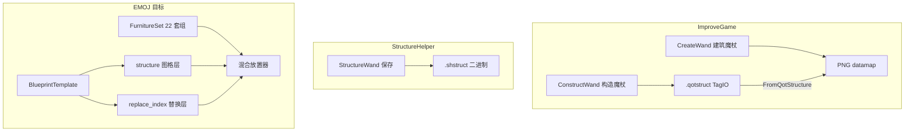

# 家具蓝图 ― 参考模组技术细节与 UI 设计规范

> **用途**：蓝图页签重构的单一技术参考文档。  
> **关联**：[`FURNITURE_BLUEPRINT.md`](FURNITURE_BLUEPRINT.md)（22 格识别与赋分）、[`PROCESS.md`](PROCESS.md)（Issues 维护约定）。  
> **在线仓库**：
> - [ImproveGame](https://github.com/487666123/ImproveGame)（分支 `1.4.4`）
> - [StructureHelper](https://github.com/ScalarVector1/StructureHelper)（release [3.1.1](https://github.com/ScalarVector1/StructureHelper/releases/tag/3.1.1)）

---

## 0. 参考代码位置（本地 + 在线）

### 0.1 存放规则

| 位置 | 是否允许 | 说明 |
|------|----------|------|
| `ModSources/EvenMoreOverpoweredJourney/` 内 | **禁止** | tModLoader 会编译其下所有 `.cs`，参考工程会导致编译失败 |
| `tModLoader/ReferenceMods/`（ModSources **外**） | **推荐** | 本机只读对照；不参与 EMOJ 编译 |
| GitHub 在线 | 随时 | 下方表格中的「在线」列 |

`build.txt` 中 `buildIgnore = …, _ref\**` 仅作 ModSources 内误放 `_ref` 的兜底，**不能**代替「放在 ModSources 外」。

### 0.2 本机参考根目录（当前已就绪）

```
c:\Users\14451\Documents\My Games\Terraria\tModLoader\ReferenceMods\
├── ImproveGame\       ← 487666123/ImproveGame @ 1.4.4
└── StructureHelper\   ← ScalarVector1/StructureHelper @ 3.1.1
```

更新参考源码（PowerShell，在 `ReferenceMods` 的**上一级**执行）：

```powershell
# ImproveGame
Invoke-WebRequest -Uri "https://github.com/487666123/ImproveGame/archive/refs/heads/1.4.4.zip" -OutFile "ReferenceMods\_ig.zip"
Expand-Archive "ReferenceMods\_ig.zip" "ReferenceMods\_ig" -Force
Remove-Item "ReferenceMods\ImproveGame" -Recurse -Force -ErrorAction SilentlyContinue
Rename-Item "ReferenceMods\_ig\ImproveGame-1.4.4" "ReferenceMods\ImproveGame"
Remove-Item "ReferenceMods\_ig","ReferenceMods\_ig.zip" -Recurse -Force

# StructureHelper
Invoke-WebRequest -Uri "https://github.com/ScalarVector1/StructureHelper/archive/refs/tags/3.1.1.zip" -OutFile "ReferenceMods\_sh.zip"
Expand-Archive "ReferenceMods\_sh.zip" "ReferenceMods\_sh" -Force
Remove-Item "ReferenceMods\StructureHelper" -Recurse -Force -ErrorAction SilentlyContinue
Rename-Item "ReferenceMods\_sh\StructureHelper-3.1.1" "ReferenceMods\StructureHelper"
Remove-Item "ReferenceMods\_sh","ReferenceMods\_sh.zip" -Recurse -Force
```

### 0.3 参考文件索引（本地路径 ? GitHub）

路径前缀：

- **IG 本地**：`c:\Users\14451\Documents\My Games\Terraria\tModLoader\ReferenceMods\ImproveGame\`
- **SH 本地**：`c:\Users\14451\Documents\My Games\Terraria\tModLoader\ReferenceMods\StructureHelper\`
- **IG 在线**：`https://github.com/487666123/ImproveGame/blob/1.4.4/`
- **SH 在线**：`https://github.com/ScalarVector1/StructureHelper/blob/3.1.1/`

#### ImproveGame ― 建筑魔杖（CreateWand / datamap / 24 材质槽）

| 主题 | 相对路径 | 本地 | 在线 |
|------|----------|------|------|
| 入口 / 中键 UI | `Content/Items/CreateWand.cs` | [本地](file:///c:/Users/14451/Documents/My%20Games/Terraria/tModLoader/ReferenceMods/ImproveGame/Content/Items/CreateWand.cs) | [GitHub](https://github.com/487666123/ImproveGame/blob/1.4.4/Content/Items/CreateWand.cs) |
| TileInfo / BuildingData | `Content/Items/CreateWand.DataStructures.cs` | [本地](file:///c:/Users/14451/Documents/My%20Games/Terraria/tModLoader/ReferenceMods/ImproveGame/Content/Items/CreateWand.DataStructures.cs) | [GitHub](https://github.com/487666123/ImproveGame/blob/1.4.4/Content/Items/CreateWand.DataStructures.cs) |
| TryPlaceBuilding / 预览 | `Content/Items/CreateWand.Core.cs` | [本地](file:///c:/Users/14451/Documents/My%20Games/Terraria/tModLoader/ReferenceMods/ImproveGame/Content/Items/CreateWand.Core.cs) | [GitHub](https://github.com/487666123/ImproveGame/blob/1.4.4/Content/Items/CreateWand.Core.cs) |
| CheckersForItem[24] | `Content/Items/CreateWand.ItemCheck.cs` | [本地](file:///c:/Users/14451/Documents/My%20Games/Terraria/tModLoader/ReferenceMods/ImproveGame/Content/Items/CreateWand.ItemCheck.cs) | [GitHub](https://github.com/487666123/ImproveGame/blob/1.4.4/Content/Items/CreateWand.ItemCheck.cs) |
| BuildingMaterials 持久化 | `Content/Items/CreateWand.IO.cs` | [本地](file:///c:/Users/14451/Documents/My%20Games/Terraria/tModLoader/ReferenceMods/ImproveGame/Content/Items/CreateWand.IO.cs) | [GitHub](https://github.com/487666123/ImproveGame/blob/1.4.4/Content/Items/CreateWand.IO.cs) |
| PNG/qotstruct 注册队列 | `Content/Items/CreateWand.BuildingRegisterSystem.cs` | [本地](file:///c:/Users/14451/Documents/My%20Games/Terraria/tModLoader/ReferenceMods/ImproveGame/Content/Items/CreateWand.BuildingRegisterSystem.cs) | [GitHub](https://github.com/487666123/ImproveGame/blob/1.4.4/Content/Items/CreateWand.BuildingRegisterSystem.cs) |
| 预览帧 | `Content/Items/CreateWand.PreviewFrame.cs` | [本地](file:///c:/Users/14451/Documents/My%20Games/Terraria/tModLoader/ReferenceMods/ImproveGame/Content/Items/CreateWand.PreviewFrame.cs) | [GitHub](https://github.com/487666123/ImproveGame/blob/1.4.4/Content/Items/CreateWand.PreviewFrame.cs) |

#### ImproveGame ― 构造魔杖（ConstructWand / .qotstruct）

| 主题 | 相对路径 | 本地 | 在线 |
|------|----------|------|------|
| 构造魔杖 | `Content/Items/ConstructWand.cs` | [本地](file:///c:/Users/14451/Documents/My%20Games/Terraria/tModLoader/ReferenceMods/ImproveGame/Content/Items/ConstructWand.cs) | [GitHub](https://github.com/487666123/ImproveGame/blob/1.4.4/Content/Items/ConstructWand.cs) |
| 矩形选区基类 | `Content/Items/SelectorItem.cs` | [本地](file:///c:/Users/14451/Documents/My%20Games/Terraria/tModLoader/ReferenceMods/ImproveGame/Content/Items/SelectorItem.cs) | [GitHub](https://github.com/487666123/ImproveGame/blob/1.4.4/Content/Items/SelectorItem.cs) |
| 结构扫描 / 保存 | `Content/Functions/Construction/QoLStructure.cs` | [本地](file:///c:/Users/14451/Documents/My%20Games/Terraria/tModLoader/ReferenceMods/ImproveGame/Content/Functions/Construction/QoLStructure.cs) | [GitHub](https://github.com/487666123/ImproveGame/blob/1.4.4/Content/Functions/Construction/QoLStructure.cs) |
| 单格图格定义 | `Content/Functions/Construction/TileDefinition.cs` | [本地](file:///c:/Users/14451/Documents/My%20Games/Terraria/tModLoader/ReferenceMods/ImproveGame/Content/Functions/Construction/TileDefinition.cs) | [GitHub](https://github.com/487666123/ImproveGame/blob/1.4.4/Content/Functions/Construction/TileDefinition.cs) |
| 协程放置 | `Content/Functions/Construction/GenerateCore.cs` | [本地](file:///c:/Users/14451/Documents/My%20Games/Terraria/tModLoader/ReferenceMods/ImproveGame/Content/Functions/Construction/GenerateCore.cs) | [GitHub](https://github.com/487666123/ImproveGame/blob/1.4.4/Content/Functions/Construction/GenerateCore.cs) |
| Tile?Item 反查表 | `Content/Functions/Construction/MaterialCore.cs` | [本地](file:///c:/Users/14451/Documents/My%20Games/Terraria/tModLoader/ReferenceMods/ImproveGame/Content/Functions/Construction/MaterialCore.cs) | [GitHub](https://github.com/487666123/ImproveGame/blob/1.4.4/Content/Functions/Construction/MaterialCore.cs) |
| .qotstruct 读写 | `Content/Functions/Construction/FileOperator.cs` | [本地](file:///c:/Users/14451/Documents/My%20Games/Terraria/tModLoader/ReferenceMods/ImproveGame/Content/Functions/Construction/FileOperator.cs) | [GitHub](https://github.com/487666123/ImproveGame/blob/1.4.4/Content/Functions/Construction/FileOperator.cs) |
| 幽灵预览 RT | `Content/Functions/Construction/PreviewRenderer.cs` | [本地](file:///c:/Users/14451/Documents/My%20Games/Terraria/tModLoader/ReferenceMods/ImproveGame/Content/Functions/Construction/PreviewRenderer.cs) | [GitHub](https://github.com/487666123/ImproveGame/blob/1.4.4/Content/Functions/Construction/PreviewRenderer.cs) |
| 放置/保存状态提示 | `Content/Functions/Construction/TipRenderer.cs` | [本地](file:///c:/Users/14451/Documents/My%20Games/Terraria/tModLoader/ReferenceMods/ImproveGame/Content/Functions/Construction/TipRenderer.cs) | [GitHub](https://github.com/487666123/ImproveGame/blob/1.4.4/Content/Functions/Construction/TipRenderer.cs) |
| 魔杖模式状态 | `Common/ModSystems/WandSystem.cs` | [本地](file:///c:/Users/14451/Documents/My%20Games/Terraria/tModLoader/ReferenceMods/ImproveGame/Common/ModSystems/WandSystem.cs) | [GitHub](https://github.com/487666123/ImproveGame/blob/1.4.4/Common/ModSystems/WandSystem.cs) |

#### ImproveGame ― UI（应对标 SilkyUI / StructureGUI）

| 主题 | 相对路径 | 本地 | 在线 |
|------|----------|------|------|
| 结构列表 / 详情 / 教程 | `UI/StructureGUI.cs` | [本地](file:///c:/Users/14451/Documents/My%20Games/Terraria/tModLoader/ReferenceMods/ImproveGame/UI/StructureGUI.cs) | [GitHub](https://github.com/487666123/ImproveGame/blob/1.4.4/UI/StructureGUI.cs) |
| 建筑魔杖 SilkyUI 布局 | `UserInterfaces/CreateWand/CreateWandController.sui.xml` | [本地](file:///c:/Users/14451/Documents/My%20Games/Terraria/tModLoader/ReferenceMods/ImproveGame/UserInterfaces/CreateWand/CreateWandController.sui.xml) | [GitHub](https://github.com/487666123/ImproveGame/blob/1.4.4/UserInterfaces/CreateWand/CreateWandController.sui.xml) |
| ViewModel | `UserInterfaces/CreateWand/CreateWandViewModel.cs` | [本地](file:///c:/Users/14451/Documents/My%20Games/Terraria/tModLoader/ReferenceMods/ImproveGame/UserInterfaces/CreateWand/CreateWandViewModel.cs) | [GitHub](https://github.com/487666123/ImproveGame/blob/1.4.4/UserInterfaces/CreateWand/CreateWandViewModel.cs) |
| 户型预览卡片 | `UserInterfaces/CreateWand/StructurePreviewCard.cs` | [本地](file:///c:/Users/14451/Documents/My%20Games/Terraria/tModLoader/ReferenceMods/ImproveGame/UserInterfaces/CreateWand/StructurePreviewCard.cs) | [GitHub](https://github.com/487666123/ImproveGame/blob/1.4.4/UserInterfaces/CreateWand/StructurePreviewCard.cs) |
| 材质槽 | `UserInterfaces/CreateWand/SUIBuildMaterialItemSlot.cs` | [本地](file:///c:/Users/14451/Documents/My%20Games/Terraria/tModLoader/ReferenceMods/ImproveGame/UserInterfaces/CreateWand/SUIBuildMaterialItemSlot.cs) | [GitHub](https://github.com/487666123/ImproveGame/blob/1.4.4/UserInterfaces/CreateWand/SUIBuildMaterialItemSlot.cs) |
| 从 qotstruct 导入卡片 | `UserInterfaces/CreateWand/ConstructStructureCard.cs` | [本地](file:///c:/Users/14451/Documents/My%20Games/Terraria/tModLoader/ReferenceMods/ImproveGame/UserInterfaces/CreateWand/ConstructStructureCard.cs) | [GitHub](https://github.com/487666123/ImproveGame/blob/1.4.4/UserInterfaces/CreateWand/ConstructStructureCard.cs) |
| 跨模组 AddPrison 说明 | `CrossModSupport.md` | [本地](file:///c:/Users/14451/Documents/My%20Games/Terraria/tModLoader/ReferenceMods/ImproveGame/CrossModSupport.md) | [GitHub](https://github.com/487666123/ImproveGame/blob/1.4.4/CrossModSupport.md) |
| datamap 像素格式说明 | `README-en.md` § AddPrison | [本地](file:///c:/Users/14451/Documents/My%20Games/Terraria/tModLoader/ReferenceMods/ImproveGame/README-en.md) | [GitHub](https://github.com/487666123/ImproveGame/blob/1.4.4/README-en.md) |

#### StructureHelper ― 结构文件 / API / 选区 UI

| 主题 | 相对路径 | 本地 | 在线 |
|------|----------|------|------|
| .shstruct 数据模型 | `Models/StructureData.cs` | [本地](file:///c:/Users/14451/Documents/My%20Games/Terraria/tModLoader/ReferenceMods/StructureHelper/Models/StructureData.cs) | [GitHub](https://github.com/ScalarVector1/StructureHelper/blob/3.1.1/Models/StructureData.cs) |
| 世界生成 API | `API/Generator.cs` | [本地](file:///c:/Users/14451/Documents/My%20Games/Terraria/tModLoader/ReferenceMods/StructureHelper/API/Generator.cs) | [GitHub](https://github.com/ScalarVector1/StructureHelper/blob/3.1.1/API/Generator.cs) |
| 保存 API | `API/Saver.cs` | [本地](file:///c:/Users/14451/Documents/My%20Games/Terraria/tModLoader/ReferenceMods/StructureHelper/API/Saver.cs) | [GitHub](https://github.com/ScalarVector1/StructureHelper/blob/3.1.1/API/Saver.cs) |
| 保存魔杖（两点选区） | `Content/Items/StructureWand.cs` | [本地](file:///c:/Users/14451/Documents/My%20Games/Terraria/tModLoader/ReferenceMods/StructureHelper/Content/Items/StructureWand.cs) | [GitHub](https://github.com/ScalarVector1/StructureHelper/blob/3.1.1/Content/Items/StructureWand.cs) |
| 放置魔杖 + 结构列表 UI | `Content/Items/TestWand.cs` | [本地](file:///c:/Users/14451/Documents/My%20Games/Terraria/tModLoader/ReferenceMods/StructureHelper/Content/Items/TestWand.cs) | [GitHub](https://github.com/ScalarVector1/StructureHelper/blob/3.1.1/Content/Items/TestWand.cs) |
| 手动放置菜单 | `Content/GUI/ManualGeneratorMenu.cs` | [本地](file:///c:/Users/14451/Documents/My%20Games/Terraria/tModLoader/ReferenceMods/StructureHelper/Content/GUI/ManualGeneratorMenu.cs) | [GitHub](https://github.com/ScalarVector1/StructureHelper/blob/3.1.1/Content/GUI/ManualGeneratorMenu.cs) |
| 保存命名弹窗 | `Content/GUI/NameConfirmPopup.cs` | [本地](file:///c:/Users/14451/Documents/My%20Games/Terraria/tModLoader/ReferenceMods/StructureHelper/Content/GUI/NameConfirmPopup.cs) | [GitHub](https://github.com/ScalarVector1/StructureHelper/blob/3.1.1/Content/GUI/NameConfirmPopup.cs) |
| 预览纹理生成 | `Util/StructurePreview.cs` | [本地](file:///c:/Users/14451/Documents/My%20Games/Terraria/tModLoader/ReferenceMods/StructureHelper/Util/StructurePreview.cs) | [GitHub](https://github.com/ScalarVector1/StructureHelper/blob/3.1.1/Util/StructurePreview.cs) |
| 3.0 格式 / 移植 | Wiki [3.0 Porting Guide](https://github.com/ScalarVector1/StructureHelper/wiki/3.0-Porting-Guide) | ― | [Wiki](https://github.com/ScalarVector1/StructureHelper/wiki/3.0-Porting-Guide) |

#### EMOJ 应对照修改的源码（ModSources 内）

| 主题 | 相对路径（相对 EMOJ 根） |
|------|--------------------------|
| 蓝图主页面 | `FurnitureBlueprint/UI/FurnitureBlueprintPage.cs` |
| 已保存行 | `FurnitureBlueprint/UI/FurnitureBlueprintSchemeRow.cs` |
| 样板房侧栏 | `FurnitureBlueprint/UI/BlueprintTemplateSecondaryPanel.cs` |
| 布局常量 | `FurnitureBlueprint/FurnitureBlueprintPageLayout.cs` |
| datamap 兼容 | `FurnitureBlueprint/BlueprintCell.cs`、`BlueprintDatamapLoader.cs` |
| 识别管线 | `FurnitureBlueprint/FurnitureSetRecognizer.cs`（等，见 `FURNITURE_BLUEPRINT.md`） |

---

## 1. 架构总览：两套魔杖 + 一层 EMOJ 独有索引



| 概念 | ImproveGame | StructureHelper | EMOJ |
|------|-------------|-----------------|------|
| 换色样板房 | datamap + 24 材质槽 | 无 | datamap/索引 + **22 套组库** |
| 真实结构复制 | `.qotstruct` | `.shstruct` | structure 层参考二者 |
| 缺件策略 | 建筑魔杖：严格；构造：逐格 skip | 原样放置 | Strict / Loose 可切换 |
| Mod 方块 | QoLStructure 名称索引表 | FullName 映射表 | 二者结合 |

---

## 2. ImproveGame 技术细节

### 2.1 建筑魔杖 `CreateWand`

| 文件（ImproveGame 仓库内路径） | 职责 |
|-------------------------------|------|
| `Content/Items/CreateWand.DataStructures.cs` | `TileInfo` / `BuildingData`；datamap 编解码 |
| `Content/Items/CreateWand.Core.cs` | `TryPlaceBuilding`、预览、跨模组 `AddPrison` |
| `Content/Items/CreateWand.ItemCheck.cs` | `CheckersForItem[24]`、`CheckersForTile[24]` |
| `Content/Items/CreateWand.IO.cs` | `BuildingMaterials[24]` 持久化 |
| `Content/Items/CreateWand.BuildingRegisterSystem.cs` | 加载 PNG / qotstruct → 注册户型 + 生成预览 RT |
| `UserInterfaces/CreateWand/*` | SilkyUI：户型卡片 + 材质槽 + 底栏 Tab |

**Datamap 像素公式**（与 EMOJ `BlueprintCell.FromColor` 一致）：

```csharp
int pixelIndex = (color.R + 1) / 64 * 5 + (color.G + 1) / 64;
bool hasWall = color.B > 127;
bool flip = color.A < 128;
```

**IG `TileSort`（24）vs EMOJ `FurnitureSlotKind`（22）**

| IG 索引 | IG 枚举 | EMOJ 对应 |
|--------|---------|-----------|
| 0�C21 | Block…Toilet | 22  wiki 槽（含 Workbench） |
| 22 | Torch | **Fixed**（不参与套组） |
| 23 | Campfire / Wall 材质槽 | Campfire→Fixed；Wall 在 EMOJ 为槽 1 |

**EMOJ `CheckersForItem[22]` 索引（`FurnitureSetMaterialCheckers`，v0.5.5+）**

| 索引 | `FurnitureSlotKind` | IG 差异说明 |
|------|---------------------|-------------|
| 0 | Block | 同 IG Block |
| 1 | Wall | IG 在索引 23；EMOJ 独立 wiki 槽 |
| 2�C21 | Bathtub…Workbench | 对齐 wiki 识别顺序（见 `FurnitureWikiSlots.RecognitionOrder`） |
| ― | Torch / Campfire | **不参与** EMOJ 22 槽（IG 索引 22�C23 → Fixed） |

- 实现文件：`FurnitureBlueprint/Registry/FurnitureSetMaterialCheckers.cs`
- **隔离**：仅 `FurnitureBlueprintSystem` 构建；识别/赋分代码不得引用；mod 兜底只读 `FurnitureTileSlotRegistry.TryGetSlotExact`

**识别覆盖（Phase 2.4，`FurnitureRecognitionOverlay`）**

1. 识别完成 → `LastRecognitionSnapshot` 写入（与 `ActiveScheme` 手改分离）
2. 详情窗「从识别覆盖」→ 优先恢复快照；否则读缓存或同步跑一次识别
3. 不修改 `FurnitureSetRecognizer` 赋分逻辑；覆盖仅替换 `ActiveScheme` 槽位

**放置顺序**（`TryPlaceBuilding`）：

1. 校验 24 槽 `MaterialConsume` ― 任一不足则**整栋失败**（严格）
2. 墙 → Block/Platform 逐格 → 家具延迟列表
3. 椅/马桶/床/浴缸 flip 后处理
4. 材料来源：魔杖槽 + 背包（`_cachedMaterialSources`）

**关键桥接**：`BuildingData.FromQotStructure(QoLStructure)` ― 完整结构可反向生成 datamap；内置模板不必手画 PNG。

### 2.2 构造魔杖 `ConstructWand`

| 文件 | 职责 |
|------|------|
| `Content/Items/SelectorItem.cs` | 矩形选区、分帧遍历、右键取消 |
| `Content/Items/ConstructWand.cs` | Save/Place 模式、打开 `StructureGUI` |
| `Content/Functions/Construction/QoLStructure.cs` | 世界扫描 → `TileDefinition[]` |
| `Content/Functions/Construction/TileDefinition.cs` | tile/wall/frame/油漆/电线/半砖/平台斜坡 |
| `Content/Functions/Construction/GenerateCore.cs` | 协程放置：Kill→Wall→Single→Multi→Wire→Frame→Sign |
| `Content/Functions/Construction/MaterialCore.cs` | 启动线程建 `TileToItem` / `WallToItem` |
| `Content/Functions/Construction/FileOperator.cs` | `.qotstruct` 扩展名、`TagIO` 读写 |
| `Content/Functions/Construction/PreviewRenderer.cs` | 构造魔杖幽灵预览（RenderTarget2D） |
| `UI/StructureGUI.cs` | 结构列表 / 详情 / 材料明细 / 预览 / 教程 GIF |

**`.qotstruct` 核心字段**：

- `Width`, `Height`, `OriginX`, `OriginY`, `BuildTime`, `ModVersion`
- `StructureData`: `List<TileDefinition>`
- `EntriesName` / `EntriesType`: mod 方块/wall 索引
- `SignTexts`: 标牌文字列表

**放置模式**（`WandSystem.Construct`）：`Save` | `Place` | `ExplodeAndPlace`（先拆后建）。

### 2.3 ImproveGame 跨模组 API

```csharp
Mod.Call("AddPrison", dataTexture, previewTexture);  // 注册 datamap 户型
CreateWand.RegisterFromQotStructureFile(path);       // qotstruct → datamap
```

EMOJ 可对称提供 `Mod.Call("AddBlueprintTemplate", …)`。

---

## 3. StructureHelper 3.1.1 技术细节

| 文件 | 职责 |
|------|------|
| `Models/StructureData.cs` | `.shstruct` 二进制读写；`ITileData` 列拷贝 |
| `API/Saver.cs` | `SaveToStructureData(x,y,w,h)` |
| `API/Generator.cs` | `GenerateStructure`；StructureCache |
| `Content/Items/StructureWand.cs` | 两点选区、拖角点、右键命名保存 |
| `Content/GUI/ManualGeneratorMenu.cs` | 结构列表 UI + TestWand 放置 |
| `Util/StructurePreview.cs` | 异步生成预览纹理（max 4096 防崩溃） |

**`.shstruct` 结构**：

```
HEADER "STRUCTURE_HELPER_STRUCTURE"
width, height, containsNbt, version
moddedTileTable[]   // localId → ModTile.FullName
moddedWallTable[]
slowColumns[]         // 含 NullTile/NullWall 的列
dataEntries{}         // Terraria/TileTypeData, WallTypeData, Liquid, Wire, Paint…
optional NBT          // TileEntity, Sign, Chest loot
```

**生成**：按列 bulk `ExportDataColumn`，比逐格 `WorldGen.PlaceTile` 快一个数量级。  
**选区 UX**：左键两点 → 可拖角点（32px 吸附）→ 右键确认 → 命名弹窗。

---

## 4. EMOJ 目标数据模型（待实现）

### 4.1 套组 `FurnitureSet`（增强现有 `FurnitureScheme`）

```csharp
// 在 FurnitureScheme 上扩展
string Id, DisplayName;
int IconItemType;          // 默认 AnchorMaterialType
int[] SlotItemTypes[22];
// 持久化：现有 fb_custom TagCompound + 新字段 icon
```

### 4.2 样板房 `BlueprintTemplate`

```
Assets/Blueprint/Templates/<id>/
  meta.json
  structure.tag      // 参考 QoLStructure
  replace.bin          // EMOJ 独有：ReplaceMode + FurnitureSlotKind + GroupId
```

```csharp
enum ReplaceMode : byte { Fixed = 0, Slot = 1, SlotGroup = 2 }
```

**放置器策略**：

| 模式 | 行为 | 参考 |
|------|------|------|
| Strict | 必需 Slot 缺件 → 拒绝 | IG `TryPlaceBuilding` |
| Loose | 缺件 skip，其余继续 | IG `GenerateCore` continue |
| Fixed 格 | 原样写入 structure | SH `GenerateFromData` |

### 4.3 必做基础设施

| 模块 | 参考 | 说明 |
|------|------|------|
| `FurnitureTileItemRegistry` | IG `MaterialCore` | 启动建 Tile?Item 反查 |
| `FurnitureSetMaterialCheckers` | IG `CreateWandHelper` | 22 槽物品分类；mod 走 `FurnitureSlotClassifier` |
| `BlueprintRegionSelector` | IG `SelectorItem` + SH `StructureWand` | 采集选区 |
| `BlueprintPreviewRenderer` | IG `PreviewRenderer` + SH `StructurePreview` | RT 预览 + 缺件着色 |

---

## 5. UI 设计规范（严格）

> **原则**：蓝图 UI 必须「像 ImproveGame / StructureHelper 一样可用」，而不是把控件堆进 Shell 内容区。  
> 参考 IG 的 **分区 + 卡片 + 底栏 Tab + 大预览**；参考 SH 的 **列表 + 右侧预览 + 工具条图标**。

### 5.1 当前 EMOJ UI 问题清单（必须修复）

| # | 现象 | 根因 | 目标 |
|---|------|------|------|
| 1 | 单页垂直堆叠：工具条、22 格、已保存、底栏挤在一起 | `FurnitureBlueprintPage` 一屏承担 4 个功能区 | **拆成主区 + 二级面板**（与 Shell 图鉴/材料浮层一致） |
| 2 | 22 格 `DisplayOnly` 无法编辑套组 | 识别与编辑混在同一网格 | **识别区只读**；**套组详情可编辑**（独立面板或 Tab） |
| 3 | 已保存套组仅文字行 +「套用」 | `FurnitureBlueprintSchemeRow` 无图标、无删除/重命名 | **卡片行**：封面贴图 + 名称 + 18/22 + 操作按钮 |
| 4 | 「建造计划」塞在窄侧栏 | `BlueprintTemplateSecondaryPanel` 预览区过小 | **样板房选择器**：左侧列表 + 右侧大预览（≥ 240px 高） |
| 5 | 工具条按钮与材料槽抢宽度 | `LayoutToolbarButtons` 硬编码 left | **固定 chrome 宽度** + 响应式换行或收进「更多」 |
| 6 | 缺件/识别中无统一反馈 | 预览与列表状态不同步 | **状态条** + 预览红/绿/灰（IG tooltip 材料计数思路） |
| 7 | 视觉层次弱 | 大量透明 `UIPanel`、字号不统一 | 统一 **Panel / Card / Toolbar** 三级背景与 8px 间距网格 |

### 5.2 信息架构（目标）

蓝图页在 Shell 内采用 **「上：工作区 / 下：库 / 右或浮层：详情」**，对标 IG CreateWand 控制器：

```
┌─ Shell 标题栏 ─────────────────────────────────────────────┐
│ [家具蓝图]                                                    │
├──────────────────────────────────────────────────────────────┤
│ A. 工作条（单行，高 48px）                                     │
│   [种子槽 52] [材料槽 40] [?]  │  识别状态文本…  │ [保存套组] [建造] │
├──────────────────────────────────────────────────────────────┤
│ B. 主 Tab 栏（高 32px，仿 IG NavBar）                          │
│   (● 套组编辑)  ( 样板房 )  ( 已保存库 )                        │
├──────────────────────────────────────────────────────────────┤
│ C. Tab 内容区（Flex 占满剩余高度）                              │
│   ┌─ 套组编辑 Tab ─────────────────────────────────────┐      │
│   │  22 格网格 8×3（可编辑）+ 右侧套组封面/重命名/删除      │      │
│   └────────────────────────────────────────────────────┘      │
│   ┌─ 样板房 Tab ───────────────────────────────────────┐      │
│   │  左：模板卡片列表（缩略图）  │  右：大预览 + Strict/Loose │      │
│   └────────────────────────────────────────────────────┘      │
│   ┌─ 已保存库 Tab ─────────────────────────────────────┐      │
│   │  套组卡片列表（材料块图标 + 填充度 + 操作）              │      │
│   └────────────────────────────────────────────────────┘      │
├──────────────────────────────────────────────────────────────┤
│ D. 底栏（高 36px，可选）                                       │
│   [消耗材料 ?] [分部位套用 ?]  提示：样板房=户型；套组=材质      │
└──────────────────────────────────────────────────────────────┘
```

**与 ImproveGame CreateWand 对照**：

| IG 区域 | IG 行为 | EMOJ 对应 |
|---------|---------|-----------|
| `ItemSlot_Container` 328×220 | 24 材质槽网格 | 套组编辑 Tab 的 22 格（或魔杖内嵌槽，后期） |
| `BuildingDataList` 卡片 | 45% 宽卡片 + 缩略图 hover | 样板房 Tab 左侧卡片 |
| `NavBar` Material / BuildingData | 底栏切换视图 | B 区主 Tab |
| `StructureGUI` 600×60% 居中面板 | 结构列表 + 详情 + 材料 + 预览 | 样板房 Tab 或独立浮层（宽 ≥ 560px） |

### 5.3 组件规范（沿用 Shell，禁止另起炉灶）

| 组件 | 使用场景 | 来源 |
|------|----------|------|
| `OPJourneyUiColors.*` | 面板/按钮/选中态 | `Shell/UI/OPJourneyUiColors.cs` |
| `EojUIScrollbar` | 所有可滚动列表 | Shell 已有 |
| `BlueprintRoundedToolbarButton` | 工作条主操作 | 保留，统一宽度 96�C104px |
| **新建** `BlueprintTabBar` | B 区 Tab | 仿 IG NavBar：底边线 + 圆角 4px 选中底 |
| **新建** `BlueprintSetCard` | 已保存/样板房卡片 | 仿 IG `StructurePreviewCard`：边距 4、圆角 8、hover 提亮 |
| **新建** `BlueprintItemSlot` | 22 格 | 尺寸见 `BlueprintSlotMetrics`；**编辑态**可拖拽 |
| **新建** `BlueprintPreviewFrame` | 大预览容器 | 深底 `#121820` + 1px 边框；内嵌 `BlueprintLayoutPreviewElement` |

**禁止**：

- 在蓝图页再写一套 `MakeButton` 半透明小方块（与 Shell 按钮风格分裂）
- 无标题的 `UIPanel` 堆叠
- 把 22 格、已保存列表、建造预览同时塞在一个无 Tab 的滚动区

### 5.4 布局常量（建议写入 `FurnitureBlueprintPageLayout`）

| 常量 | 值 | 说明 |
|------|-----|------|
| `WorkBarHeight` | 48 | A 区 |
| `MainTabBarHeight` | 32 | B 区 |
| `BottomBarHeight` | 36 | D 区 |
| `SetGridColumns` | 8 | 22 格布局 |
| `SetGridVisibleRows` | 3 | 视口行数 |
| `TemplateListWidth` | 0.38f (percent) | 样板房左栏 |
| `PreviewMinHeight` | 240 | 预览最小高度 |
| `CardHeight` | 72 | 已保存套组卡片 |
| `CardIconSize` | 48 | 封面物品贴图 |
| `SectionGap` | 8 | 全局间距（8px 网格） |
| `PanelPadding` | 12 | 内容区内边距（对齐 IG `SetPadding(12)`） |

Shell 宽度：继续用 `FurnitureBlueprintPageLayout.RecommendedShellWidth`，Tab 化后**不再**在单页内用 `SavedPanelMinHeight` 硬挤。

### 5.5 交互规范

| 操作 | 行为 | 参考 |
|------|------|------|
| 拖入种子 | 识别 → 工作条状态文本 → 22 格刷新 | 现有 + IG 材料 tooltip |
| 保存套组 | 若已选中库项 → 覆盖确认；否则命名 | IG 文件命名弹窗 |
| 点击已保存卡片 | 选中 + 加载到编辑 Tab | IG 点 StructurePanel → 详情 |
| 样板房卡片 | 选中 + 右侧预览 + 更新 `ActiveTemplateId` | IG StructurePreviewCard |
| 缺件 | 预览红色；Strict 下放置按钮禁用；Loose 下黄色警告 | IG tooltip `[c/ff0000:…]` |
| 识别中 | 22 格 skeleton / 「识别中…」；禁止保存 | ― |
| 删除套组 | 卡片上 ? 或右键菜单；二次确认 | SH 命名确认弹窗思路 |

### 5.6 预览规范

1. **套组/样板房预览**：优先运行时 tile 绘制（`FurnitureBlueprintTilePreviewDraw`）；失败再 fallback PNG。
2. **缩放**：仿 IG `StructurePreviewCard` ― `scaler = Min(availW/w, availH/h)`，居中 draw。
3. **缺件着色**：绿=已配置；红=Strict 缺件；灰=Fixed 原样；黄=Loose 将跳过。
4. **世界幽灵预览**：仅手持 `BlueprintDeployer` 时（现有 `FurnitureBlueprintPreviewSystem`），与 UI 预览共用同一 scheme 快照。
5. **最大尺寸**：参考 SH 3.1.1 ― 预览 RT 单边 ≤ 4096px。

### 5.7 UI 实施阶段

| 阶段 | 内容 | 验收 |
|------|------|------|
| UI-1 | Tab 栏 + 三区内容切换；工作条单行化 | 1280×720 下无重叠、无裁切 |
| UI-2 | 已保存套组卡片（图标/重命名/删除） | 与图鉴页卡片风格一致 |
| UI-3 | 套组编辑 Tab：22 格可拖拽 | 保存后持久化 |
| UI-4 | 样板房 Tab：列表 + 大预览 + Strict/Loose | 切换模板预览 < 1 帧卡顿 |
| UI-5 | 状态条 + 缺件着色 + 识别 busy | 与放置器 Strict/Loose 一致 |

---

## 6. 文件格式与放置（摘要）

详细流水线见上文 §2�C§4；实现顺序建议：

1. **P1** 套组 CRUD + UI-1~UI-3  
2. **P2** `FurnitureTileItemRegistry`  
3. **P3** `.eopjbp` structure + replace_index  
4. **P4** 结构魔杖 + UI-4  
5. **P5** 混合放置器 + UI-5  
6. **P6** Legacy 导入（IG datamap、可选 SH `.shstruct`）

---

## 7. 参考源码速查（目录级）

完整**逐文件**本地路径与 GitHub 链接见 **§0.3**。以下为目录树速查。

### ImproveGame（本地根：`ReferenceMods\ImproveGame\`）

| 目录 | 内容 |
|------|------|
| `Content/Items/CreateWand*.cs` | 建筑魔杖：datamap、24 槽、TryPlaceBuilding |
| `Content/Items/ConstructWand.cs` + `SelectorItem.cs` | 构造魔杖 + 选区 |
| `Content/Functions/Construction/` | QoLStructure、GenerateCore、MaterialCore、PreviewRenderer |
| `UI/StructureGUI.cs` | 结构文件列表 / 材料明细 / 预览 / 教程 |
| `UserInterfaces/CreateWand/` | SilkyUI：户型卡片、材质 Tab、导入 |
| `Common/ModSystems/WandSystem.cs` | Save / Place / ExplodeAndPlace 模式 |

### StructureHelper（本地根：`ReferenceMods\StructureHelper\`）

| 目录 | 内容 |
|------|------|
| `Models/StructureData.cs` | `.shstruct` 二进制 |
| `API/Generator.cs`、`API/Saver.cs` | 对外 API |
| `Content/Items/StructureWand.cs` | 保存选区 |
| `Content/GUI/ManualGeneratorMenu.cs` | 放置 UI |
| `Util/StructurePreview.cs` | 预览 RT |

### EMOJ（ModSources 内，待重构）

见 §0.3 末尾 EMOJ 表；UI 规范见 §5。

---

## 8. 文档维护

- 蓝图 **识别赋分** 变更 → 同步 `FURNITURE_BLUEPRINT.md`  
- 蓝图 **UI / 格式 / 放置** 变更 → 同步本文  
- 蓝图 **阶段排期 / 开工任务** → 同步 `BLUEPRINT_IMPLEMENTATION.md`  
- 版本发布 → `CHANGELOG.md` + `build.txt`

---

*文档版本：2026-05-26；本机参考：`tModLoader/ReferenceMods/ImproveGame`（1.4.4）、`ReferenceMods/StructureHelper`（3.1.1）。*
